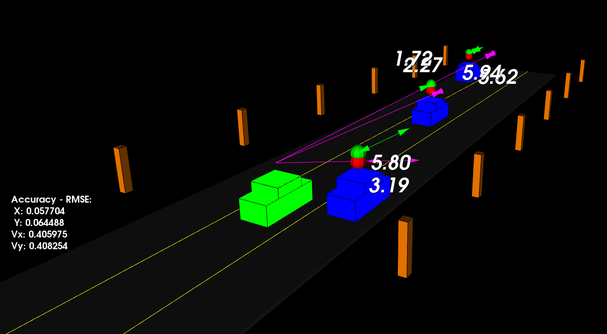

# Unscented Kalman Filter Project (Улучшенный Фильтр Калмана)

Проект выполнен в рамках моего обучения на программе UDACITY Self-Driving Car Engineer (модуль Sensor Fusion). На этом курсе я изучала распознавание объектов с помощью датчиков лидара, радара и камеры, отслеживание объектов с помощью изображений с камеры, определение дальности и скорости цели на основе данных радара и объединение лидарных и радарных измерений для прогнозирования движения объекта с использованием фильтра Калмана.  

В проекте **Unscented Kalman Filter** реализован улучшенный фильтр Калмана (UKF) для оценки состояния нескольких автомобилей с использованием лидарных и радарных измерений.  

В программе используется класс `Highway` для создания прямой 3-полосной автомагистрали с 3 машинами для отслеживания и главной машиной ego в центре. Сцена просмотра сосредоточена вокруг автомобиля ego, и система координат также относится к автомобилю ego. Транспортные средства ускоряются и меняют рулевое управление, чтобы перестроиться в другую полосу. `Z` ось не учитывается при отслеживании, поэтому отслеживание происходит только вдоль осей`X/Y`.  

Для каждого транспортного средства сгенерирован свой собственный объект фильтра Калмана (UKF). Данные лидара и радара для движущихся автомобилей непрерывно поступают в их UKF соответственно. Эти данные обрабатываются в UKF, чтобы положение и скорость каждого автомобиля можно было оценить с помощью циклов прогнозирования-обновления. В фильтре используется модель движения с постоянной скоростью поворота (`CTRV`).  

Точность оценивается по среднеквадратичной ошибке (`RMSE`) на каждом временном шаге и для каждого автомобиля.  

Приведенный ниже результат иллюстрирует сценарий дорожного движения. Автомобиль ego окрашен в зеленый цвет, другие транспортные средства - в синий. Красные сферы над автомобилями обозначают обнаружение лидаром, а фиолетовые линии показывают измерения радаром с величиной скорости вдоль обнаруженного угла. Зеленые сферы над автомобилями обозначают предсказанный UKF путь, по которому автомобили будут двигаться в ближайшем будущем.  


Детали проекта - [unscented-kalman-filter-project](unscented-kalman-filter-project).  

## I. Ход выполнения проекта

1. Инициализация параметров UKF:  

- размерность вектора состояния `n_x_`
- вектор состояния `x_`
- ковариационная матрица состояния `P_`
- размерность расширенного вектора состояния `n_aug_`
- матрица прогнозируемых сигма-точек `Xsig_pred_`
- вектор весов сигма-точек `weights_`
- стандартное отклонение шума продольного ускорения `std_a_`
- стандартное отклонение шума ускорения по рысканию `std_yawdd_`
- коэффициент масштабирования сигма-точек `lambda_`

2. Реализация `UKF::ProcessMeasurement()`  

Для самого первого входящего измерения вектор состояния `x_`, ковариационная матрица `P_`, и параметр времени `time_us_` инициализируются в соответствии с исходными данными `meas_package.raw_measurements_` и `meas_package.timestamp_`.  

Для следующих измерений обновляется параметр времени `time_us_`, вызывается последовательность функций `Prediction()` и `UpdateLidar()`/`UpdateRadar()`.  

3. Реализация `UKF::Prediction()`

Процесс прогнозирования одинаков как для лидарных, так и для радиолокационных измерений:   

- создается расширенные вектор со средним состоянием `x_aug` и расширенная ковариационная матрица состояния `P_aug`  
- генерируется матрица сигма-точек `Xsig_aug` для ранее оцененного вектора состояния  
- предсказывается матрица сигма-точек `Xsig_pred_` для текущего вектора состояния   
- прогнозируется среднее состояние `x_` и ковариационная матрица `P_` с использованием весов и предсказанных сигма-точек  

4. Реализация `UKF::UpdateLidar()` и `UKF::UpdateRadar()`

Шаги по обновлению лидарных и радарных измерений аналогичны, за исключением того, что лидарные точки указаны в **Декартовых координатах**, а радарные точки - в **Полярных координатах**. Следовательно, они отличаются размерностью измерения `n_z`, размерностью матриц и уравнениями преобразования.  

Как правило, они выполняют те же шаги для обновления результатов измерений:  

- преобразовать предсказанные сигма-точки `Xsig_pred_` в пространство измерений `Zsig` в зависимости от типов датчиков  
- рассчитать среднее состояние `z_` и ковариационную матрицу `S` с учетом шума  
- вычислить матрицу взаимной корреляции `Tc` между пространством состояний и пространством измерений
- рассчитать коэффициент усиления по Калману `K`  
- обновить вектор состояния `x_` и ковариацию `P_`  

5. Тестовый запуск

На скриншоте, показанном ниже, показан один из моментов реализации проекта. Автомобиль ego зеленого цвета, другие транспортные средства синего цвета. Красные сферы над автомобилями обозначают `(x,y)` обнаружение лидаром, а фиолетовые линии показывают измерения радаром с величиной скорости вдоль обнаруженного угла. Зеленые сферы над автомобилями представляют собой прогнозируемый путь, по которому автомобили будут двигаться в ближайшем будущем.  

В левой нижней части в режиме реального времени вычисляются среднеквадратичные ошибки `(RMSE)` для положения `(x,y)` и скорости `(Vx, Vy)`, которые представляют точность прогнозирования.  



## II. Подготовка и запуск проекта на Ubuntu

Для этого проекта требуется установка библиотеки Point Cloud Library (PCL).

```bash
$ sudo apt install libpcl-dev
```

### Структура проекта:
- media: визуализация результатов проекта
- src
    * render
        + `box.h`: структура для определения объектов
        + `render.h`, `render.cpp`: классы и методы для рендеринга объектов
    * sensors
        * data - исходные файлы с облаками точек лидара для визуализации
        + `lidar.h`: функции, использующие преобразование лучей для создания PCD
    * `highway`: шоссе с основным автомобилем и 3 машинами для отслеживания
    * `main.cpp`: запуск проекта
    * `measurement_package.h`: измерения лидара и радара
    * `tools.h`, `tools.cpp`: вспомогательные функции
    * `ukf.h`, `ukf.cpp`: реализация улучшенного фильтра Калмана

### Сборка и запуск проекта. Должно появиться окно с имитацией дорожной обстановки.
```bash
$ cd Kalman_Filters/unscented-kalman-filter-project
$ mkdir build && cd build
$ cmake ..
$ make
$ ./ukf_highway
```

## III. Детали отладки

В файле `highway.h`, есть ряд параметров, которые можно изменить для целей отладки.

- `trackCars` - список позволяет включать / выключать автомобили для отслеживания объекта UKF
- `projectedTime` и `projectedSteps` - управляют визуализацией спрогнозированного положения
- `visualize_pcd` - настраивает визуализацию данных лидарного облака точек

```c++
// автомобили, отслеживаемые с помощью UKF
std::vector<bool> trackCars = {true,true,true};
// визуализируемые измерения датчиков
bool visualize_lidar = true;
bool visualize_radar = true;
bool visualize_pcd = false;
// на какой период предсказать параметры объектов в будущем с помощью UKF
double projectedTime = 0;
int projectedSteps = 0;
```

## IV. Other exercises

[Kalman Filter Equation exercise](kf-equation-exercise)

[Laser Measurement Exercise](laser-measurement-exercise)

[Jacobian Matrix Exercise](jacobian-matrix-exercise)

[Root Mean Squared Err Exercise](root-mean-squared-err-exercise)

[Unscented Kalman Filter Exercise](ukf-exercise)


## V. Дальнейшие планы

В рамках курса **Sensor Fusion** я работаю еще над 2-мя проектами:

- определение дальности и скорости объекта на основе данных радара,
- отслеживание объекта с использованием изображений с камеры.


## VI. Ссылки

[Sensor Fusion EKF Reference.pdf](sensor-fusion-ekf-reference.pdf)