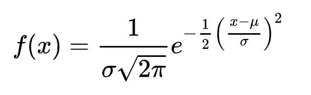
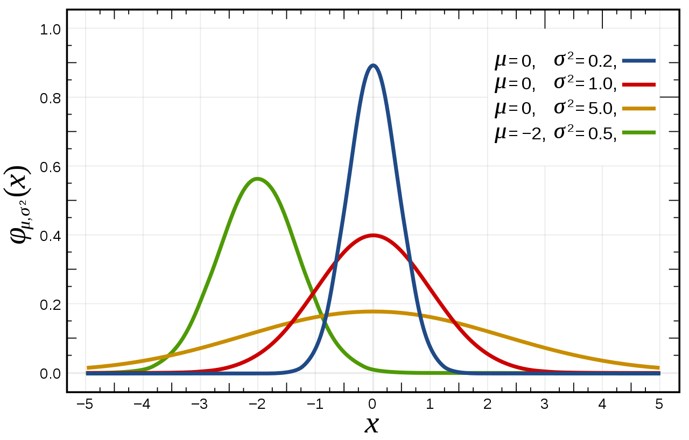
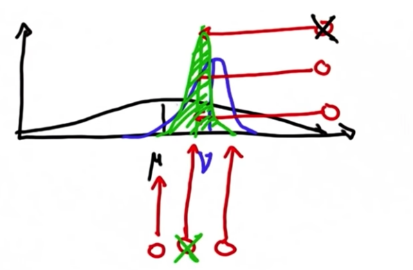
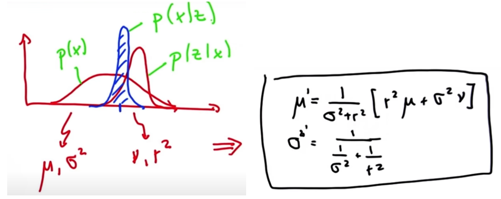
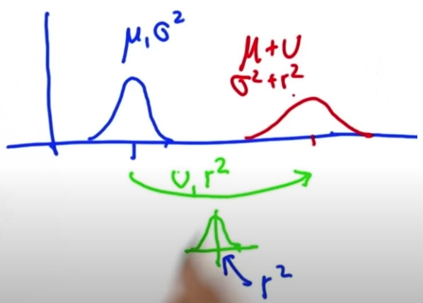
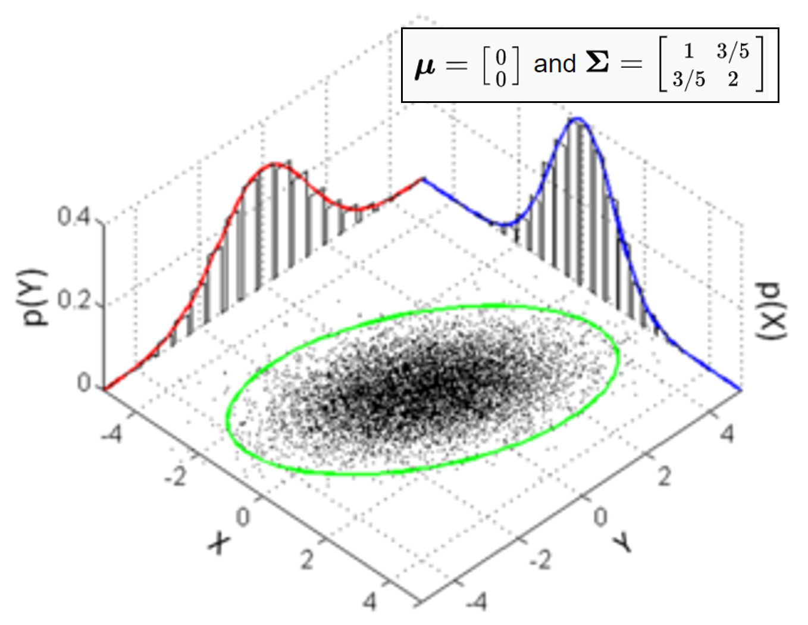
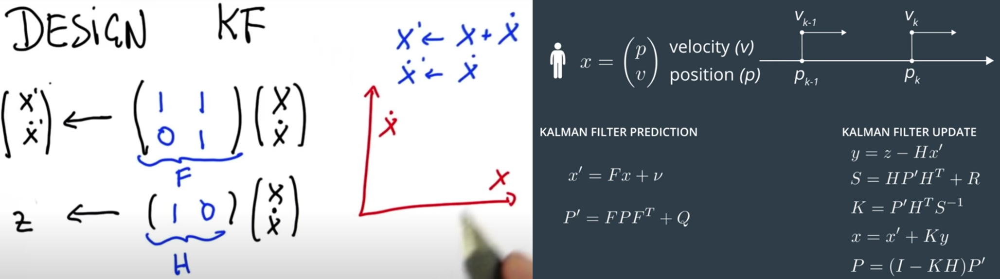

# Lecture 4-1 Kalman Filters

## I. Gaussian Function

Gaussian functions are often used to represent the probability density function of a normally distributed random variable with the **expected value (mean)** `mu` and **variance** `sigma^2`.



- Evaluations
    * the max value of the Gaussian function is obtained when `x = mu`
    * different mean `mu` shifts the distribution toward `+` or `-` of the x-axis
    * larger the variance `sigma^2`, wider the spread of distribution



## II. Kalman Filter

- Kalman filter represents our distributions by Gaussian and iterates on two main cycles
    * First cycle: **measurement update**
        + requires a product/multiplication
        + uses Bayes rule
    * Second cycle: **motion update** (prediction)
        + involves a convolution
        + uses total probability

#### Measurement update

- Shift of the mean
    * the new belief will be *somewhere between* the previous belief and the new measurement
- Predict the peak
    * the new belief will be *more certain* than either the previous belief or the new measurement
    * because more measurements means greater certainty



The mean and variance of the new Gaussian can be calculated by the following equations.



#### Motion update (Prediction)

The Gaussian parameters for motion update are much simpler than measurement update, just adding the two means and two variance to yield the new ones.



#### Python implementation

```python
# iteratively update and predict based on the location measurements and inferred motions shown below. 

def update(mean1, var1, mean2, var2):
    new_mean = float(var2 * mean1 + var1 * mean2) / (var1 + var2)
    new_var = 1./(1./var1 + 1./var2)
    return [new_mean, new_var]

def predict(mean1, var1, mean2, var2):
    new_mean = mean1 + mean2
    new_var = var1 + var2
    return [new_mean, new_var]

measurements = [5., 6., 7., 9., 10.]
motion = [1., 1., 2., 1., 1.]
measurement_sig = 4.
motion_sig = 2.
mu = 0.
sig = 10000.

for n in range(len(measurements)):
    [mu, sig] = update(mu, sig, measurements[n], measurement_sig)
    print 'update: ', [mu, sig]
    [mu, sig] = predict(mu, sig, motion[n], motion_sig)
    print 'predict: ', [mu, sig]
```

#### С++ implementation
```C++
#include <iostream>
#include <vector>

std::vector<double> update(double mean1, double var1, double mean2, double var2) {
    double new_mean = (var2 * mean1 + var1 * mean2) / (var1 + var2);
    double new_var = 1.0 / (1.0 / var1 + 1.0 / var2);
    return {new_mean, new_var};
}

std::vector<double> predict(double mean1, double var1, double mean2, double var2) {
    double new_mean = mean1 + mean2;
    double new_var = var1 + var2;
    return {new_mean, new_var};
}

int main() {
    std::vector<double> measurements = {5.0, 6.0, 7.0, 9.0, 10.0};
    std::vector<double> motion = {1.0, 1.0, 2.0, 1.0, 1.0};
    double measurement_sig = 4.0;
    double motion_sig = 2.0;
    double mu = 0.0;
    double sig = 10000.0;

    for (size_t n = 0; n < measurements.size(); ++n) {
        std::vector<double> update_result = update(mu, sig, measurements[n], measurement_sig);
        mu = update_result[0];
        sig = update_result[1];
        std::cout << "update: [" << mu << ", " << sig << "]" << std::endl;

        std::vector<double> predict_result = predict(mu, sig, motion[n], motion_sig);
        mu = predict_result[0];
        sig = predict_result[1];
        std::cout << "predict: [" << mu << ", " << sig << "]" << std::endl;
    }

    return 0;
}
```

## III. Kalman Filter Design

High Dimensional Gaussian or Multivariate Gaussian features a *k*-dimensional **mean vector**, and a *k x k* **covariance matrix**.



For a Kalman filter for vehicle, the two dimensions to use are *location* and *velocity*.

#### KF Design

`x`: location estimation
`P`: uncertainty covariance
`F`: state transition matrix
`v`: motion vector
`Z`: measurement
`H`: measurement function
`y`: error
`S`: matrix projecting the system uncertainty into the measurement space
`R`: measurement noise matrix
`K`: Kalman filter gain, combining the uncertainty of where we think we are `P` and uncertainty of sensor measurement `R`. If `P > R`, KF will give more weight to sensor measurement `z`. If `P < R`, more weight will be put on predicted `x`.
`I`: identity matrix



#### Python implementation
```python
from math import *

class matrix:
    '''
    implements basic operations of a matrix class
    '''
    def __init__(self, value):
        self.value = value
        self.dimx = len(value)
        self.dimy = len(value[0])
        if value == [[]]:
            self.dimx = 0
    
    def zero(self, dimx, dimy):
        # check if valid dimensions
        if dimx < 1 or dimy < 1:
            raise ValueError, "Invalid size of matrix"
        else:
            self.dimx = dimx
            self.dimy = dimy
            self.value = [[0 for row in range(dimy)] for col in range(dimx)]
    
    def identity(self, dim):
        # check if valid dimension
        if dim < 1:
            raise ValueError, "Invalid size of matrix"
        else:
            self.dimx = dim
            self.dimy = dim
            self.value = [[0 for row in range(dim)] for col in range(dim)]
            for i in range(dim):
                self.value[i][i] = 1
    
    def show(self):
        for i in range(self.dimx):
            print(self.value[i])
        print(' ')
    
    def __add__(self, other):
        # check if correct dimensions
        if self.dimx != other.dimx or self.dimy != other.dimy:
            raise ValueError, "Matrices must be of equal dimensions to add"
        else:
            # add if correct dimensions
            res = matrix([[]])
            res.zero(self.dimx, self.dimy)
            for i in range(self.dimx):
                for j in range(self.dimy):
                    res.value[i][j] = self.value[i][j] + other.value[i][j]
            return res
    
    def __sub__(self, other):
        # check if correct dimensions
        if self.dimx != other.dimx or self.dimy != other.dimy:
            raise ValueError, "Matrices must be of equal dimensions to subtract"
        else:
            # subtract if correct dimensions
            res = matrix([[]])
            res.zero(self.dimx, self.dimy)
            for i in range(self.dimx):
                for j in range(self.dimy):
                    res.value[i][j] = self.value[i][j] - other.value[i][j]
            return res
    
    def __mul__(self, other):
        # check if correct dimensions
        if self.dimy != other.dimx:
            raise ValueError, "Matrices must be m*n and n*p to multiply"
        else:
            # multiply if correct dimensions
            res = matrix([[]])
            res.zero(self.dimx, other.dimy)
            for i in range(self.dimx):
                for j in range(other.dimy):
                    for k in range(self.dimy):
                        res.value[i][j] += self.value[i][k] * other.value[k][j]
            return res
    
    def transpose(self):
        # compute transpose
        res = matrix([[]])
        res.zero(self.dimy, self.dimx)
        for i in range(self.dimx):
            for j in range(self.dimy):
                res.value[j][i] = self.value[i][j]
        return res
    
    # Thanks to Ernesto P. Adorio for use of Cholesky and CholeskyInverse functions
    
    def Cholesky(self, ztol=1.0e-5):
        # Computes the upper triangular Cholesky factorization of
        # a positive definite matrix.
        res = matrix([[]])
        res.zero(self.dimx, self.dimx)
        
        for i in range(self.dimx):
            S = sum([(res.value[k][i])**2 for k in range(i)])
            d = self.value[i][i] - S
            if abs(d) < ztol:
                res.value[i][i] = 0.0
            else:
                if d < 0.0:
                    raise ValueError, "Matrix not positive-definite"
                res.value[i][i] = sqrt(d)
            for j in range(i+1, self.dimx):
                S = sum([res.value[k][i] * res.value[k][j] for k in range(self.dimx)])
                if abs(S) < ztol:
                    S = 0.0
                try:
                   res.value[i][j] = (self.value[i][j] - S)/res.value[i][i]
                except:
                   raise ValueError, "Zero diagonal"
        return res
    
    def CholeskyInverse(self):
        # Computes inverse of matrix given its Cholesky upper Triangular
        # decomposition of matrix.
        res = matrix([[]])
        res.zero(self.dimx, self.dimx)
        
        # Backward step for inverse.
        for j in reversed(range(self.dimx)):
            tjj = self.value[j][j]
            S = sum([self.value[j][k]*res.value[j][k] for k in range(j+1, self.dimx)])
            res.value[j][j] = 1.0/tjj**2 - S/tjj
            for i in reversed(range(j)):
                res.value[j][i] = res.value[i][j] = -sum([self.value[i][k]*res.value[k][j] for k in range(i+1, self.dimx)])/self.value[i][i]
        return res
    
    def inverse(self):
        aux = self.Cholesky()
        res = aux.CholeskyInverse()
        return res
    
    def __repr__(self):
        return repr(self.value)

# KF implementation
def kalman_filter(x, P):
    for n in range(len(measurements)):
        # measurement update
        Z = matrix([[measurements[n]]])
        y = Z - (H * x)
        S = H * P * H.transpose() + R
        K = P * H.transpose() * S.inverse()
        x = x + (K * y)
        P = (I - (K * H)) * P

        # prediction
        x = (F * x) + u
        P = F * P * F.transpose()
    
    # return location estimation, uncertainty covariance
    return x, P

# Test Below
measurements = [1, 2, 3]

x = matrix([[0.], [0.]]) # initial state (location and velocity)
P = matrix([[1000., 0.], [0., 1000.]]) # initial uncertainty
u = matrix([[0.], [0.]]) # external motion
F = matrix([[1., 1.], [0, 1.]]) # next state function
H = matrix([[1., 0.]]) # measurement function
R = matrix([[1.]]) # measurement uncertainty
I = matrix([[1., 0.], [0., 1.]]) # identity matrix

print(kalman_filter(x, P))
# output should be:
# x: [[3.9996664447958645], [0.9999998335552873]]
# P: [[2.3318904241194827, 0.9991676099921091], [0.9991676099921067, 0.49950058263974184]]
```
#### С++ implementation
```C++
#include <iostream>
#include <vector>
#include <cmath>
#include <stdexcept>

class Matrix {
    std::vector<std::vector<double>> value;
    int dimx, dimy;

public:
    // Конструктор класса Matrix
    Matrix(std::vector<std::vector<double>> value) : value(value) {
        dimx = value.size();
        dimy = value[0].size();
        if (value == std::vector<std::vector<double>>(1, std::vector<double>(0))) {
            dimx = 0;
        }
    }

    // Метод для создания нулевой матрицы заданных размеров
    void zero(int dimx, int dimy) {
        if (dimx < 1 || dimy < 1) {
            throw std::invalid_argument("Неверный размер матрицы");
        } else {
            this->dimx = dimx;
            this->dimy = dimy;
            value = std::vector<std::vector<double>>(dimx, std::vector<double>(dimy, 0));
        }
    }

    // Метод для создания единичной матрицы заданного размера
    void identity(int dim) {
        if (dim < 1) {
            throw std::invalid_argument("Неверный размер матрицы");
        } else {
            dimx = dim;
            dimy = dim;
            value = std::vector<std::vector<double>>(dim, std::vector<double>(dim, 0));
            for (int i = 0; i < dim; i++) {
                value[i][i] = 1;
            }
        }
    }

    // Метод для отображения матрицы
    void show() {
        for (int i = 0; i < dimx; i++) {
            for (int j = 0; j < dimy; j++) {
                std::cout << value[i][j] << " ";
            }
            std::cout << std::endl;
        }
        std::cout << std::endl;
    }

    // Перегрузка оператора сложения матриц
    Matrix operator+(const Matrix& other) const {
        if (dimx != other.dimx || dimy != other.dimy) {
            throw std::invalid_argument("Матрицы должны иметь одинаковые размеры для сложения");
        } else {
            Matrix res(std::vector<std::vector<double>>(dimx, std::vector<double>(dimy, 0)));
            for (int i = 0; i < dimx; i++) {
                for (int j = 0; j < dimy; j++) {
                    res.value[i][j] = value[i][j] + other.value[i][j];
                }
            }
            return res;
        }
    }

    // Перегрузка оператора вычитания матриц
    Matrix operator-(const Matrix& other) const {
        if (dimx != other.dimx || dimy != other.dimy) {
            throw std::invalid_argument("Матрицы должны иметь одинаковые размеры для вычитания");
        } else {
            Matrix res(std::vector<std::vector<double>>(dimx, std::vector<double>(dimy, 0)));
            for (int i = 0; i < dimx; i++) {
                for (int j = 0; j < dimy; j++) {
                    res.value[i][j] = value[i][j] - other.value[i][j];
                }
            }
            return res;
        }
    }

    // Перегрузка оператора умножения матриц
    Matrix operator*(const Matrix& other) const {
        if (dimy != other.dimx) {
            throw std::invalid_argument("Матрицы должны иметь размеры m*n и n*p для умножения");
        } else {
            Matrix res(std::vector<std::vector<double>>(dimx, std::vector<double>(other.dimy, 0)));
            for (int i = 0; i < dimx; i++) {
                for (int j = 0; j < other.dimy; j++) {
                    for (int k = 0; k < dimy; k++) {
                        res.value[i][j] += value[i][k] * other.value[k][j];
                    }
                }
            }
            return res;
        }
    }

    // Метод для вычисления транспонированной матрицы
    Matrix transpose() const {
        Matrix res(std::vector<std::vector<double>>(dimy, std::vector<double>(dimx, 0)));
        for (int i = 0; i < dimx; i++) {
            for (int j = 0; j < dimy; j++) {
                res.value[j][i] = value[i][j];
            }
        }
        return res;
    }

    // Метод для вычисления обратной матрицы с использованием разложения Холецкого
    Matrix Cholesky() const {
        Matrix res(std::vector<std::vector<double>>(dimx, std::vector<double>(dimx, 0)));
        for (int i = 0; i < dimx; i++) {
            double S = 0;
            for (int k = 0; k < i; k++) {
                S += pow(res.value[k][i], 2);
            }
            double d = value[i][i] - S;
            if (std::abs(d) < 1.0e-5) {
                res.value[i][i] = 0.0;
            } else {
                if (d < 0.0) {
                    throw std::invalid_argument("Матрица не является положительно определенной");
                }
                res.value[i][i] = sqrt(d);
            }
            for (int j = i + 1; j < dimx; j++) {
                double S = 0;
                for (int k = 0; k < dimx; k++) {
                    S += res.value[k][i] * res.value[k][j];
                }
                if (std::abs(S) < 1.0e-5) {
                    S = 0.0;
                }
                res.value[i][j] = (value[i][j] - S) / res.value[i][i];
            }
        }
        return res;
    }

    // Метод для вычисления обратной матрицы с использованием разложения Холецкого
    Matrix CholeskyInverse() const {
        Matrix res(std::vector<std::vector<double>>(dimx, std::vector<double>(dimx, 0)));
        for (int j = dimx - 1; j >= 0; j--) {
            double tjj = value[j][j];
            double S = 0;
            for (int k = j + 1; k < dimx; k++) {
                S += value[j][k] * res.value[j][k];
            }
            res.value[j][j] = 1.0 / pow(tjj, 2) - S / tjj;
            for (int i = j - 1; i >= 0; i--) {
                double temp = 0;
                for (int k = i + 1; k < dimx; k++) {
                    temp += value[i][k] * res.value[k][j];
                }
                res.value[j][i] = res.value[i][j] = -temp / value[i][i];
            }
        }
        return res;
    }

    // Метод для вычисления обратной матрицы
    Matrix inverse() const {
        Matrix aux = Cholesky();
        Matrix res = aux.CholeskyInverse();
        return res;
    }

    // Перегрузка оператора вывода
    friend std::ostream& operator<<(std::ostream& os, const Matrix& matrix) {
        for (int i = 0; i < matrix.dimx; i++) {
            for (int j = 0; j < matrix.dimy; j++) {
                os << matrix.value[i][j] << " ";
            }
            os << std::endl;
        }
        os << std::endl;
        return os;
    }
};

Matrix x({{0}, {0}}); // начальное состояние (положение и скорость)
Matrix P({{1000., 0.}, {0., 1000.}}); // начальная неопределенность
Matrix F({{1., 1.}, {0., 1.}}); // функция следующего состояния
Matrix H({{1., 0.}}); // функция измерения
Matrix R({{1.}}); // неопределенность измерения
Matrix I({{1., 0.}, {0., 1.}}); // единичная матрица
Matrix u({{0.}, {0.}}); // внешнее движение

std::pair<Matrix, Matrix> kalman_filter(Matrix x, Matrix P) {
    std::vector<double> measurements = {1, 2, 3};

    for (int n = 0; n < measurements.size(); ++n) {
        // Обновление измерения
        Matrix Z({{measurements[n]}});
        Matrix y = Z - (H * x);
        Matrix S = H * P * H.transpose() + R;
        Matrix K = P * H.transpose() * S.inverse();
        x = x + (K * y);
        P = (I - (K * H)) * P;

        // Предсказание
        x = (F * x) + u;
        P = F * P * F.transpose();
    }

    return std::make_pair(x, P);
}

int main() {
    // Тестирование
    std::pair<Matrix, Matrix> result = kalman_filter(x, P);
    Matrix estimation = result.first;
    Matrix covariance = result.second;

    // Вывод оценки положения и ковариации неопределенности
    std::cout << "Оценка положения: " << std::endl << estimation;
    std::cout << "Ковариация неопределенности: " << std::endl << covariance;

    return 0;
}
```

## IV. Equation Cheatsheet

[Sensor Fusion EKF Reference.pdf](../sensor-fusion-ekf-reference.pdf)